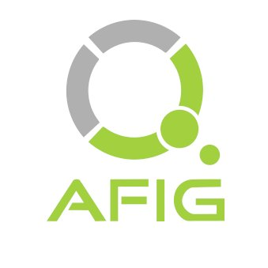

Depuis 2017, le GdR IG-RV organise un prix de thèse IGRV avec le soutien des associations [AFIG](https://www.asso-afig.fr/site/), [AFXR](https://www.afxr.org) et [EGFR](https://projet.liris.cnrs.fr/egfr/). 

<table>
<tr>
  <td></td>
  <td></td>
  <td></td>
 </tr>
 </table>

L’objectif de ce prix de thèse est de récompenser chaque année une excellente thèse issue de la communauté du GdR IG-RV.

L’intérêt est double. Pour le ou la jeune docteur(e) concerné(e), ce prix apportera une grande visibilité à ses travaux et une reconnaissance de la communauté du GdR sur l’excellence des résultats obtenus. Pour la communauté du GdR, ce prix permettra de rendre visible très largement des travaux de premier ordre issus de nos thématiques de recherche. Le contour disciplinaire du prix est celui du GdR Informatique Géométrique et Graphique, Réalité Virtuelle et Visualisation et de ses groupes de travail.

Chaque année le jury du prix de thèse du GdR propose un(e) lauréat(e) et d'éventuels accessits au comité de pilotage du GdR pour validation. Le jury constitué de membres représentatifs des thèmes du GdR IG-RV est présidé par {} et {}.

# Modalités

Les modalités pratiques sont précisées ci-dessous et rappelées par mail sur la liste du GdR IG-RV.
Peuvent candidater les personnes ayant soutenu leur thèse au cours de l'année civile précédant l'année de tenue du jury du prix et dont la thèse est accessible publiquement. Une tolérance est prévue pour les thèses sujettes à confidentialité, à condition que la thèse soit rendue publique au plus tard un an après la date de soutenance. Dans ce cas, la candidature au prix de thèse est possible l'année civile suivant la date de levée de la confidentialité.

Les pièces suivantes seront demandées :
* un CV (2 pages maximum) ;
* une liste de publications ;
* le manuscrit de thèse ;
* les rapports des rapporteurs (-trices) ;
* le rapport soutenance ;

Ce prix de thèse du GdR IG-RV est parrainé par la SIF. Le GdR encourage les candidats de nos domaines à déposer des dossiers au prix de thèse Gilles Kahn de la SIF, et en particulier le(a) lauréat(e) et les éventuels accessits du prix de thèse du GdR IG-RV.
