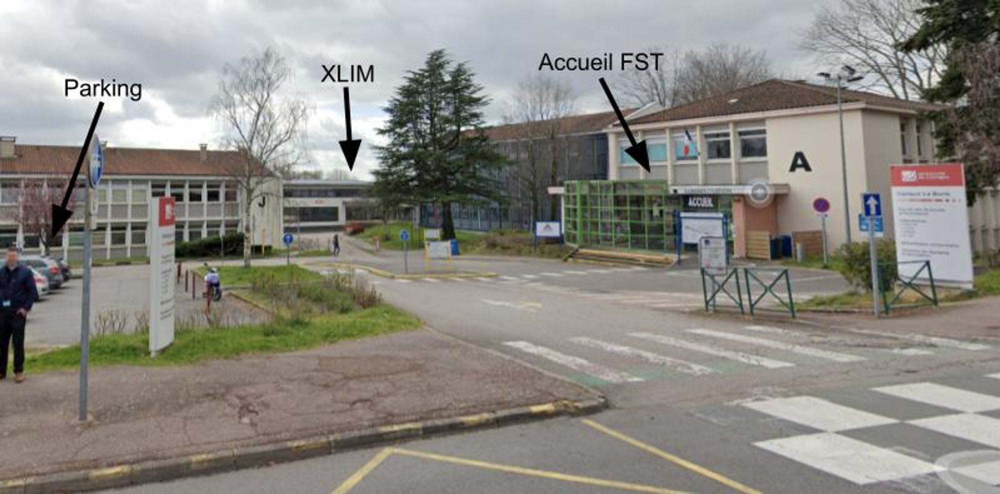
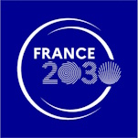
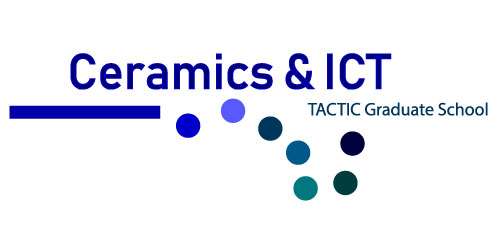

Les prochaines journées du Groupe de Travail Animation et Simulation du GDR IGRV auront lieu les 11 et 12 juillet 2024, à Limoges (Laboratoire XLIM).

L’objet des Journées du GT AS est triple. Il s’agit :
- de partager les avancées de la recherche en animation et simulation,
- de dresser le paysage du domaine en France, et
- d’en préciser les perspectives et les thématiques émergentes.

**Le thème focus cette année sera: Animation et simulation de phénomènes naturels.**

Les inscriptions sont ouvertes. A faire en remplissant [ce formulaire](https://forms.gle/XJPmmHccMw79JiwS7). 

## Infos pratiques
### Lieu

> Salle de conférences, Laboratoire XLIM
> 
> 123 Av. Albert Thomas, 87000 Limoges

[Emplacement sur Google Maps](https://maps.app.goo.gl/THQKxM9HY9E63crq6)

Accès depuis le centre-ville (bus n°8 dir "Mal Joffre" - arrêt "Campus La Borie") 

Accès en bus par la ligne 8 (dir “Mal Joffre”, arrêt “Campus La Borie”) : 
- Site TCL : https://www.stcl.fr
- App MyBus (achat de billet en ligne):  https://www.mybus.io/
- Depuis la gare des Bénédictins, prendre d’abord la ligne 6 (dir “Mal Juin”) puis rejoindre la ligne 8 à partir des arrêts “Pl. W. Churchill” ou “Mauvendière”

Depuis l’arrêt de bus ou le parking principal du campus de la Faculté des Sciences :  

### Sélection Hôtels

- [ENZO HOTELS LIMOGES CENTRE JOURDAN By KYRIAD DIRECT](https://maps.app.goo.gl/1ZNepm5CYuUpamkr6)
- [ibis Limoges Centre](https://maps.app.goo.gl/R8emehZgkj4kRDQm9)
- [MERCURE LIMOGES CENTRE](https://maps.app.goo.gl/a7qLdDysTBZT8XKp8)
- [Hôtel Campanile Limoges Centre Gare](https://maps.app.goo.gl/5baFd9r3fmUVeBnR7)
- [Contact Hôtel Des Deux Moulins](https://maps.app.goo.gl/EbrEDwoThP42U7t79)

# Programme 
**Jeudi 11 juillet**

12h30-13h55 : buffet végétarien (salle XR201)

13h55-14h00 : ouverture du GTAS

14h-15h30 : session 1

- 14h-14h20 : **SMEAR: Stylized Motion Exaggeration with ARt-direction**, *Jean Basset, Pierre Bénard, Pascal Barla*, Inria Bordeaux Sud-Ouest, Équipe Manao. 
- 14h25-14h45 : **Fixed-radius Nearest Neighbour Search using Delaunay Triangulations**, *Heinich Porro.*
- 14h45-15h30 : démarrage de l’atelier **Systèmes de particules avec Shadertoy**, *C. Plateau--Holleville*, XLIM Limoges - Venez avec votre ordinateur portable !!!

15h30-15h45 : pause café

- 15h45-16h30 : suite de l’atelier
- 16h30-17h : enseignement de l’AS et avec l’AS
    - Intervention à distance “**Apprentissage Enactif : Réalité Virtuelle et Systèmes Haptiques au service du « learning by doing » en Nanosciences et en STIC à l’université Grenoble Alpes**”, Nicolas Castagné, MCF en Informatique, Florence Marchi, MCF en Physique

18h-19h : moment artistique

- Guillaume Demaison, graphiste et motion designer, [Studio Kailis](https://kailis-design.net/)
- Lieu : [Orge et Houblon](https://maps.app.goo.gl/WBWS22cUhWqgW5hF9)

19h30 : rdv [Chez Alphonse](https://maps.app.goo.gl/rGFTgf9zVAyjtKFYA) (à confirmer)

---

**Vendredi 12 juillet**

9h : accueil

9h-10h30 - session 2 “Animation et simulation de phénomènes naturels” ****+ discussions

- 9h-9h20 : **Windblown Sand Around Obstacles - Simulation and Validation of Deposition Patterns**, *Nicolas Rosset, Régis Duvigneau, Adrien Bousseau, Guillaume Cordonnier,* Inria Université Côte d’Azur, Équipes GraphDeco & Acumes. (Lien HAL: https://hal.science/INRIA2/hal-04566241v1)
- 9h25-9h45 : **Simulation de pluie**, *Gabriel Cadilhac*, XLIM Limoges. 
- 9h50-10h10 : **Un framework de simulation d'océan temps réel,** *David Algis, Emmanuelle Darles, Bérenger Bramas, Lilian Aveneau,* Université de Poitiers, Laboratoire XLIM & Studio Nyx & Inria de Nancy. 

10h10-10h30 : discussions

10h30-10h45 : pause café

10h45-11h35 : atelier **Simulation de fluide avec [FluidX3D](https://github.com/ProjectPhysX/FluidX3D),** *Louis Forestier*, XLIM Poitiers (salle de TP I213 - à confirmer)

11h35-12h30 : prospectives, session en ligne sur :

https://grenoble-inp.zoom.us/j/95742816391

Code secret: gtas

12h30-13h55 : buffet végétarien (salle XR202)

**Sponsors**

