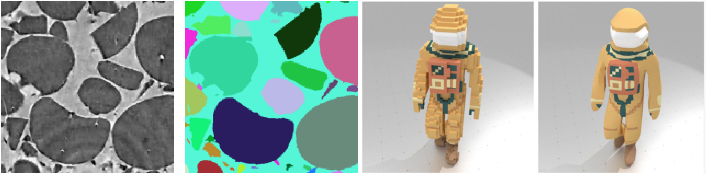

* **Site** : http://gt-gdmm.u-bordeaux.fr
* **Responsables** : Isabelle Sivignon (GIPSA-Lab, Grenoble) et Jean Cousty (LIGM, Marne-la-Vallée)
* **Mots-clés** : Géométrie discrète, morphologie mathématique, topologies discrète et digitale, imagerie discrète, graphes.

 

* **Description** : Par définition, le barycentre du GT GDMM est
    constitué par la Morphologie mathématique et de la Géométrie
    discrète, deux domaines dans lesquels la recherche française tient
    historiquement une place prépondérante. Néanmoins, les champs
    d’investigation du GT GDMM se sont largement ouverts au cours des
    dernières années, et la géométrie discrète comme la morphologie
    mathématique se développent désormais fortement à leurs interfaces,
    et notamment en lien avec les domaines suivants :

  * Traitement de la géométrie ou Geometry processing, géométrie algorithmique, analyse numérique pour la géométrie digitale ;
  *  Optimisation discrète, théorie des graphes, traitement du signal, machine learning pour la morphologie mathématique.

    Ainsi, en sus des travaux intrinsèquement liés au GT GDMM, ces
    développements permettent d’établir des ponts avec plusieurs autres
    grands domaines relevant du GdR IGRV. On peut souligner par exemple des
    liens avec des problématiques de rendu (e.g. le développement
    d’opérateurs différentiels robustes pour l’application de textures sur
    des données discrètes) ; de la modélisation géométrique (e.g. modéli-
    sation par croquis via une forme digitale, modélisation de formes
    digitales par union de convexes) ; ou encore de la visualisation
    (e.g. visualisation de données de grandes dimensions par l’utilisation
    de modèles hiérarchiques de structures combinatoires).
