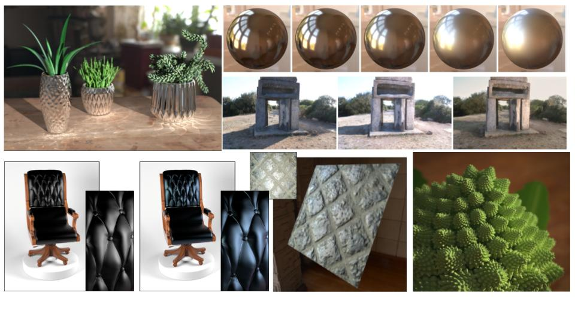

* **Site** : http://gtrendu.blogspot.fr/
* **Responsable** : Romain Vergne (LJK, Grenoble), George Drettakis (INRIA, Sophia-Antipolis)
* **Mots-clés** : rendu photo réaliste, simulation de l'éclairage et d'effets lumineux, rendu inverse, rendu expressif, rendu artistique, réalité augmentée, rendu temps réel, rendu basé image.

 

* **Description** : Les objectifs du GT Rendu peuvent se résumer comme suit :
	* Comprendre et prendre en compte la plupart des phénomènes lumineux pour créer des images réalistes, en maîtrisant les erreurs engendrées entre les modèles utilisés et la réalité.
	* Comprendre, modéliser et mettre en évidence les informations pertinentes pour obtenir des images adaptées à la communication et à l'expression visuelle.

	Les modèles de rendu, réaliste ou non, deviennent de plus en plus complexes et conduisent donc à des temps de calcul de plus en plus grands. L'un des enjeux de la synthèse d'images reste le développement d'algorithmes plus performants en terme de vitesse de calcul. Un problème scientifique fondamental concerne la manipulation temps réel de grands volumes de données. Des problèmes algorithmiques difficiles restent à explorer et rejoignent les problèmes algorithmiques précédemment cités si l'on veut bénéficier de techniques de visualisation temps réel et dynamique des données.
	Les travaux récents des équipes françaises d'informatique graphique ont permis des avancées significatives dans la plupart des thématiques liées au rendu :
	* L'acquisition et la représentation de matériaux qui constituent des problèmes complexes pour obtenir des images réalistes de manière efficace.
	* L'intelligence artificielle, et notamment sur l'apprentissage profond, qui nécessite un grand nombre d'images et de données en entrée qui sont souvent impossible à obtenir. La synthèse est une des clés permettant de générer ces données.
	* L'échantillonnage des données sur chaque pixel qui constitue un aspect primordial pour générer des images de qualité rapidement lors de la résolution de l'équation du rendu. Même si le problème n'est pas récent, il est toujours traité activement par la communauté.
	* Le rendu expressif, dont l'objectif est de produire des images stylisées ou plausibles en s'appuyant sur des schémas d'approximation du transport de la lumière ainsi que sur des analyses et expériences perceptuelles.
	* La génération de textures (par l'exemple ou procéduralement) qui constitue également un domaine de recherche actif pour obtenir des solutions en temps réel en contrôlant précisément les aspects de l'apparence finale des surfaces.
