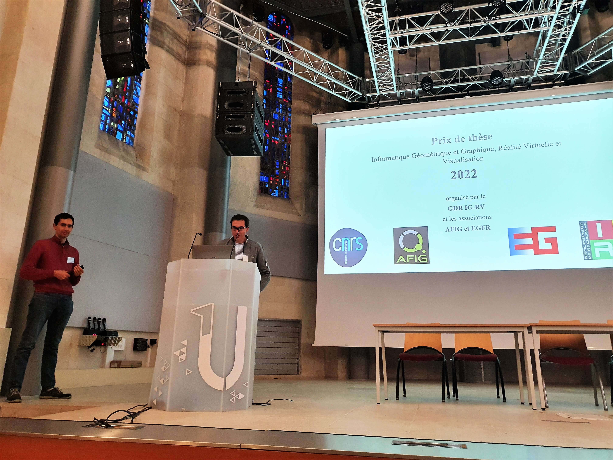
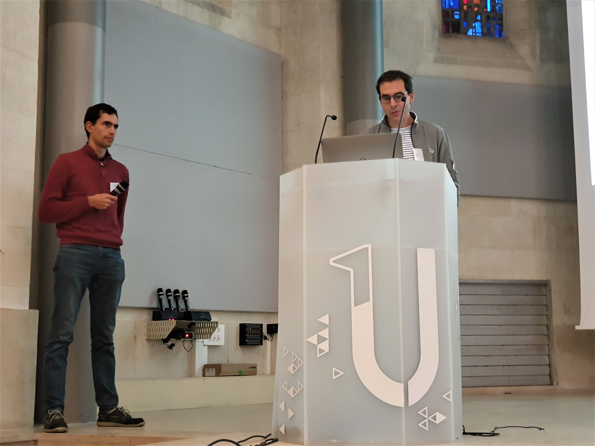
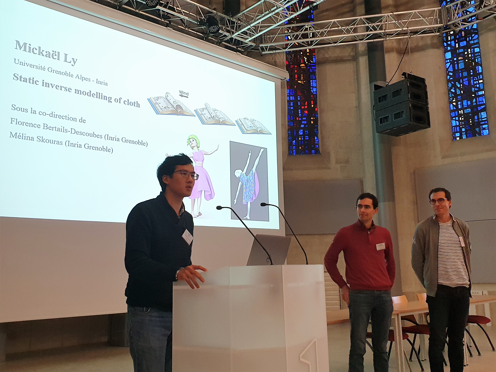
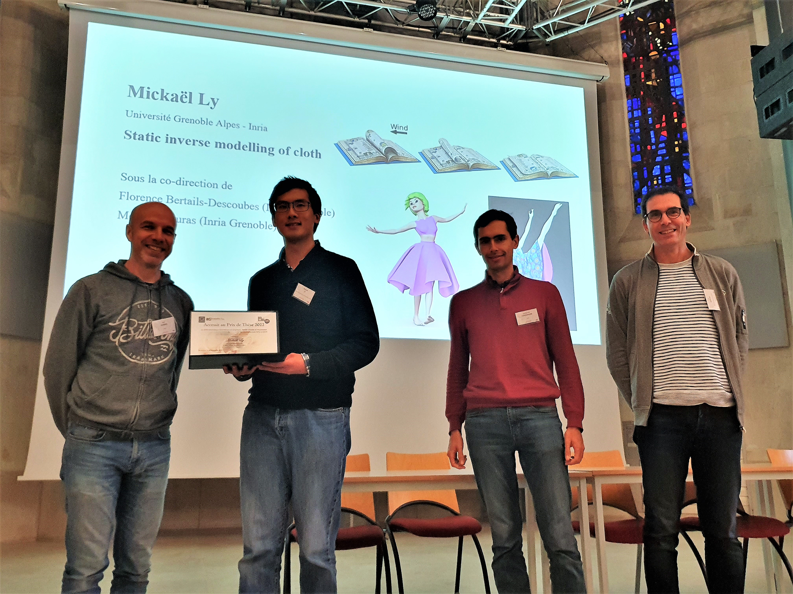
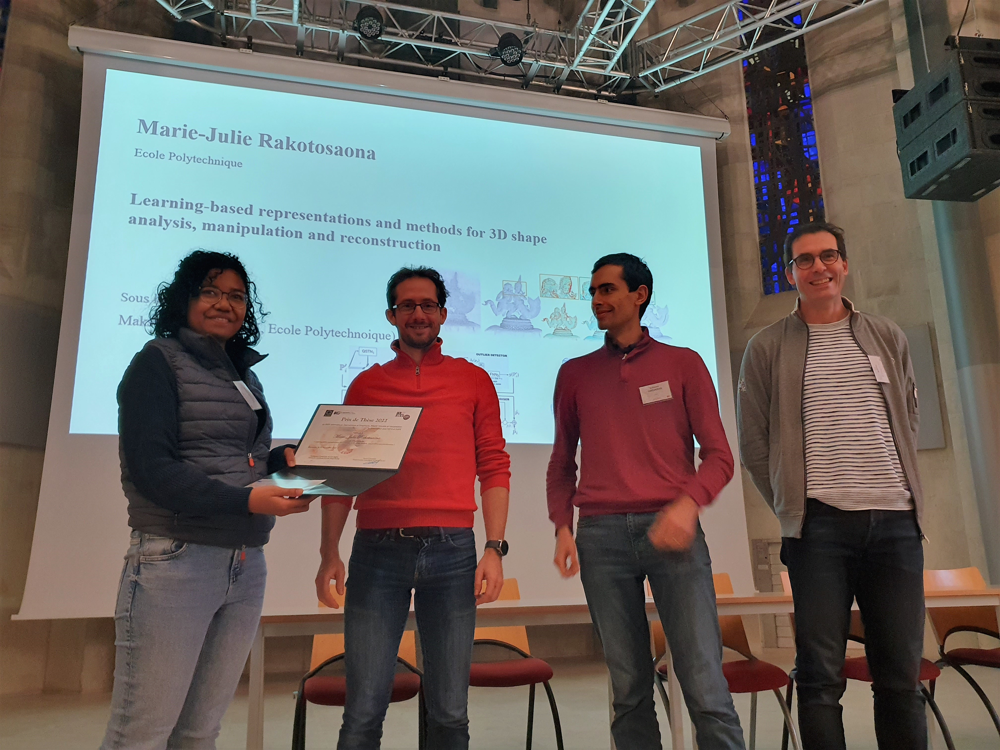

À l'occasion des [Journées Françaises de l'Informatique Graphique](https://project.inria.fr/jfig2022/), le [prix de thèse](https://gdr-igrv.fr/actions/prix-these/) du GdR a pu être remis à
 **Marie-Julie Rakotosaona** pour sa thèse intitulée « Learning-based representations and methods for 3D shape analysis, manipulation and reconstruction » effectuée sous la direction de Maks Ovsjanikov (Ecole Polytechnique).  Ainsi que l'accessit  **Mickael Ly** pour sa thèse intitulée « Static inverse modelling of cloth » effectuée sous la direction de Florence Bertails-Descoubes et Mélina Skouras (Université Grenoble Alpes).

Le prix a été remis par les organisateurs du Prix de thèse  {} (Univ Toulouse) et {} (INRIA CRISAM),  ainsi que les présidents de l'AFIG, **Basile Sauvage** et du Chapitre Français d'Eurographics (EGFR), **Eric Guérin**.

