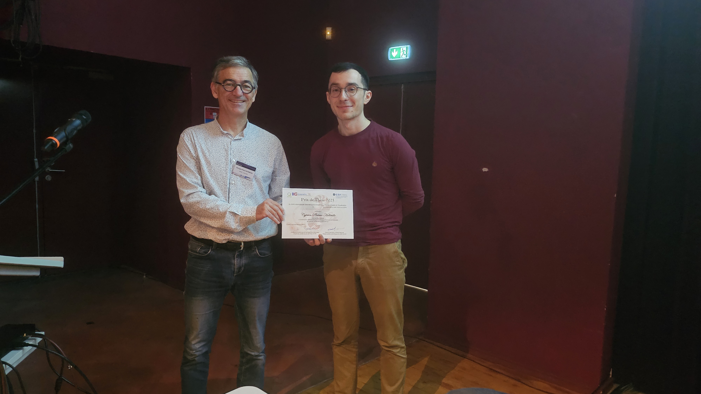

À l'occasion des [Journées Françaises de l'Informatique Graphique](https://project.inria.fr/jfig2022/), le [prix de thèse](https://gdr-igrv.fr/actions/prix-these/) du GdR a pu être remis à
 **Cyprien Plateau-Holleville** (XLIM, Université de Limoges)  pour sa thèse intitulée « Construction efficace de géométrie pour l’analyse structurelle de grands systèmes moléculaires ».
 
Le prix a été remis par les organisateurs du Prix de thèse  {},  ainsi que les présidents de l'AFIG, **
Maxime Maria** et du Chapitre Français d'Eurographics (EGFR), **??????**.

*(photos Adrien Peytavie)*

